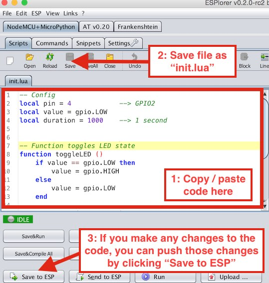
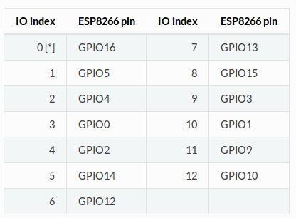

# GET STARTED: NodeMCU #

On this segment you will be told about the first steps on getting started with NodeMCU, from flashing the micro controller to start using it in your IoT amazing project.
(You can also find a server side tutorial in here: [GET STARTED: Node server](../wcServer/README.md)).

## How to Install Esptool and flash nodeMCU ##

The following toturial e based on the official one that you can find [here](https://nodemcu.readthedocs.io/en/master/en/flash/) and some of.

First of all we need to **install Python**: 

	sudo apt-get install python3.1

Now we **need Esptool**, a Python-based utility to communicate with the ROM bootloader. 
You can find it in the repo under wcController/docs/esptool or you can download it Esptool [here](https://github.com/espressif/esptool).

Lets start by **erasing the content** on the NodeMCU.

	python esptool.py --port /dev/ttyUSB0 erase_flash

And now **flash it** with the pretended firmware, both _esp_init_data_default.bin_ and _nodemcu-master-18-modules-2016-10-07-14-52-07-integer.bin_ can be found in the repo under wcController/docs.

	python esptool.py --port /dev/ttyUSB0 write_flash -fm dio -fs 32m 0x00000 nodemcu-master-18-modules-2016-10-07-14-52-07-integer.bin 0x3fc000 esp_init_data_default.bin
    
**Note** : make sure /dev/ttyUSB0 is the port in which NodeMCU is connected to, if not, change it. 

(if you would like to understand this big command you can find information about it in [here](https://espressif.com/en/support/explore/get-started/esp8266/getting-started-guide) ).

Follows the best part of this tutorial, where you start playing with the micro.

## Programming NodeMCU and Lua.init ##

We need just one more tool in order to programme and upload the files to the NodeMC, ESPlorer.

ESPlorer is the essential multiplatforms tools for any ESP8266 developer from luatool author’s, you can download it [here](https://github.com/4refr0nt/ESPlorer) or find it 

Now we have everything ready to start playing with NodeMCU.

There is a nice tutorial in [here](https://odd-one-out.serek.eu/esp8266-nodemcu-getting-started-hello-world/) on how to get started and make a simple "hello world" :

### Programming the ESP8266 ###

The ESP8266 with the NodeMCU firmware executes Lua files. When booting the device it will look for a file called init.lua and execute this file. But first we will clear the device of every file

1) In ESPlorer, click the format button to delete all files.

2) Next copy / paste the following code into the left hand box in ESPlorer.

    
    -- Config
    local pin = 4            --> GPIO2
    local value = gpio.LOW
    local duration = 1000    --> 1 second

    -- Function toggles LED state
    function toggleLED ()
        if value == gpio.LOW then
            value = gpio.HIGH
        else
            value = gpio.LOW
        end

        gpio.write(pin, value)
    end

    -- Initialise the pin
    gpio.mode(pin, gpio.OUTPUT)
    gpio.write(pin, value)

    -- Create an interval
    tmr.alarm(0, duration, 1, toggleLED)

3) Save the file as “init.lua”. This will automatically upload the file to the ESP8266Save_to_ESP

4) Now the blue onboard LED should blink on and off every second. If you restart the device, it will load the init.lua file and keep on blinking

Here I added some usefull documentation and notes, an always work in progress, **Cheat Sheet**.

**Esp8266 Nodemcu Dev Kit V3 Pins:**

**Esp8266 Nodemcu GPIO Pin Index:**

If you are using the [deep sleep](https://nodemcu.readthedocs.io/en/master/en/modules/rtctime/#example) you: 

 - DO NOT FORGET TO PLUG PIN RST AND D0 (GPIO16 - USER - WAKE)
